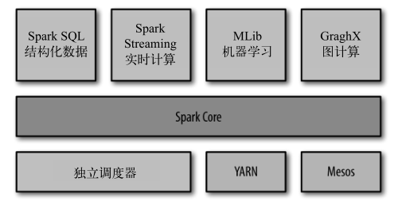

### 1.2　一个大一统的软件栈 ###
Spark 的核心是一个对由很多计算任务组成的、运行在多个工作机器或者是一个计算集群上的应用进行调度、分发以及监控的计算引擎。
#### 各组件间密切结合的优点 ####
-   软件栈中所有的程序库和高级组件都可以从下层的改进中获益。
-   运行整个软件栈的代价变小了。
-   能够构建出无缝整合不同处理模型的应用。
### Spark 软件栈 ###

#### Spark Core ####
Spark Core 实现了 Spark 的基本功能
-   任务调度
-   内存管理
-   错误恢复
-   与存储系统交互  

Spark Core 中还包含了对弹性分布式数据集（简称 RDD）的 API 定义。  
RDD 表示分布在多个计算节点上可以并行操作的元素集合，是Spark 主要的编程抽象。  
Spark Core 提供了创建和操作这些集合的多个 API。
#### Spark SQL ####
-   Spark SQL 是 Spark 用来操作结构化数据的程序包。  
-   通过 Spark SQL，我们可以使用 SQL 或者 Apache Hive 版本的 SQL 方言（HQL）来查询数据。  
-   Spark SQL 支持多种数据源，比如 Hive 表、Parquet 以及 JSON 等。
#### Spark Streaming ####
-   Spark Streaming 是 Spark 提供的对实时数据进行流式计算的组件。  
-   Spark Streaming 提供了用来操作数据流的 API，并且与 Spark Core 中的 RDD API 高度对应。
-   Spark Streaming 支持与 Spark Core 同级别的容错性、吞吐量以及可伸缩性。
#### MLlib ####
-   MLlib 提供了很多种机器学习算法，包括分类、回归、聚类、协同过滤等，还提供了模型评估、数据导入等额外的支持功能。
-   MLlib 还提供了一些更底层的机器学习原语，包括一个通用的梯度下降优化算法。
#### GraphX ####
GraphX 是用来操作图的程序库，可以进行并行的图计算。  
#### 集群管理器 ####
Spark 支持在各种集群管理器上运行：
-   Hadoop YARN
-   Apache Mesos
-   Spark 自带的一个简易调度器，叫作独立调度器。