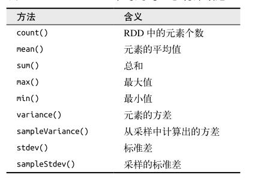

### 6.6　数值RDD的操作 ###
Spark 对包含数值数据的 RDD 提供了一些描述性的统计操作。  

Spark 的数值操作是通过流式算法实现的，允许以每次一个元素的方式构建出模型。  
这些统计数据都会在调用 stats() 时通过一次遍历数据计算出来，并以 StatsCounter 对象返回。  
  

#### 代码 ####
-   [Python](P6NumericRDD.py)
-   [Scala](S6NumericRDD.scala)
-   [Java](J6NumericRDD.java)