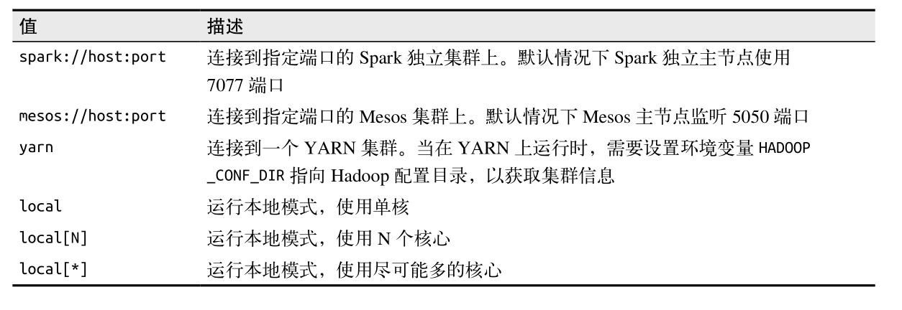

### 7.3　使用spark-submit部署应用 ###
Spark 为各种集群管理器提供了统一的工具来提交作业，这个工具是 spark-submit 。  

提交 Python 应用：
``` 
bin/spark-submit my_script.py
```
如果在调用 spark-submit 时除了脚本或 JAR 包的名字之外没有别的参数，那么这个 Spark 程序只会在本地执行。

sad
``` 
bin/spark-submit --master spark://host:7077 --executor-memory 10g my_script.py
```
--master 标记指定要连接的集群 URL
  
spark-submit 的一般格式：
``` 
bin/spark-submit [options] <app jar | python file> [app options]

[options] 是要传给 spark-submit 的标记列表。可以运行 spark-submit --help 列出所有可以接收的标记。
<app jar | python File> 表示包含应用入口的 JAR 包或 Python 脚本。
[app options] 是传给应用的选项。
```  
spark-submit 的一些常见标记：

