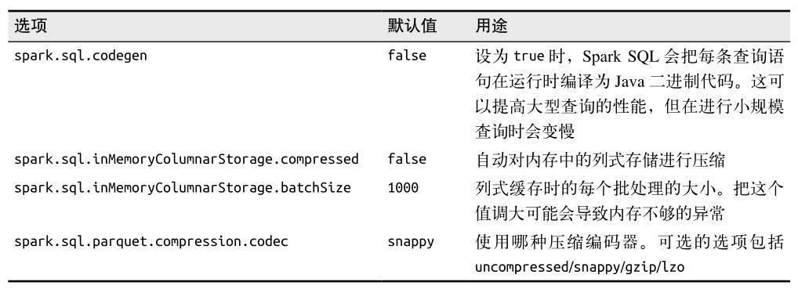

#### 9.6　Spark SQL 性能 ####
Spark SQL 可以利用其对类型的了解来高效地表示数据。  

当缓存数据时，Spark SQL 使用内存式的列式存储。  
这不仅仅节约了缓存的空间，而且尽可能地减少了后续查询中针对某几个字段查询时的数据读取。  



打开 codegen 选项的 Beeline 命令：
``` 
beeline> set spark.sql.codegen=true;
SET spark.sql.codegen=true
spark.sql.codegen=true
Time taken: 1.196 seconds
```
在 Scala 中打开 codegen 选项的代码：
``` 
conf.set("spark.sql.codegen", "true")
```


-   **park.sql.codegen**   
这个选项可以让 Spark SQL 把每条查询语句在运行前编译为 Java 二进制代码。  
由于生成了专门运行指定查询的代码，codegen 可以让大型查询或者频繁重复的查询明显变快。

-   **spark.sql.inMemoryColumnarStorage.batchSize**  
在缓存 SchemaRDD 时，Spark SQL 会按照这个选项制定的大小（默认值是 1000）把记录分组，然后分批压缩。  
太小的批处理大小会导致压缩比过低，而批处理大小过大的话，比如当每个批次处理的数据超过内存所能容纳的大小时，也有可能会引发问题。  
